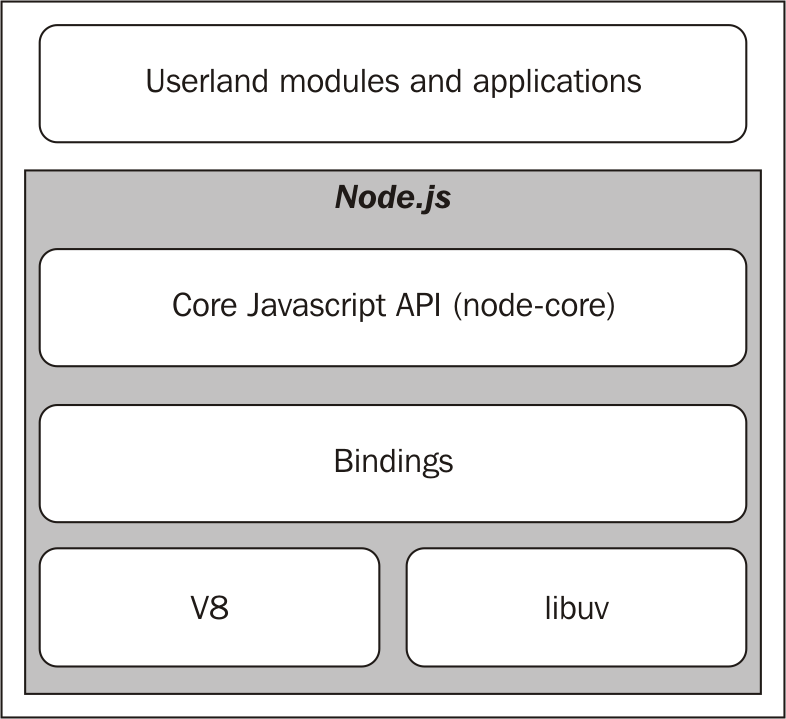

# The reactor pattern
    the heart of the asynchronous nature of Node.js

- I/O is slow
    
- Blocking I/O

- Non-blocking I/O

- Event demultiplexing

## Introducing the reactor pattern
  
1. The application generates a new I/O operation by submitting a request to the
    **Event Demultiplexer**. The application also specifies a handler, which will be
    invoked when the operation completes. Submitting a new request to the **Event
    Demultiplexer** is a non-blocking call and it immediately returns control to the
    application.
2. When a set of I/O operations completes, the **Event Demultiplexer** pushes the new
    events into the **Event Queue**.
3. At this point, the **Event Loop** iterates over the items of the **Event Queue**.
4. For each event, the associated handler is invoked.
5. The handler, which is part of the application code, will give back control to the
    **Event ** when its execution completes (5a). However, new asynchronous
    operations might be requested during the execution of the handler (5b), causing
    new operations to be inserted in the **Event Demultiplexer** (1), before control is
    given back to the Event Loop.
6. When all the items in the Event Queue are processed, the loop will block again
    on the **Event Demultiplexer** which will then trigger another cycle when a new
    event is available.
   
## The non-blocking I/O engine of Node.js-libuv
[An Introduction to libuv](http://nikhilm.github.io/uvbook/)
## The recipe for Node.js
 
