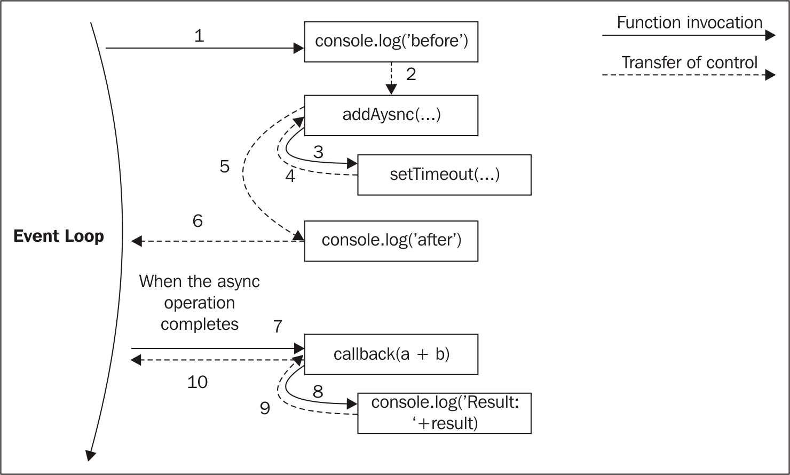

#2. Node.js Essential Patterns
    two of the most important asynchronous patterns: callback and event emitter
## The callback pattern
## The continuation-passing style
### Synchronous continuation-passing style
### Asynchronous continuation-passing style
  
## Non-continuation-passing style callbacks
    the result is returned synchronously using a direct style.
## Synchronous or asynchronous?
### An unpredictable function
One of the most dangerous situations is to have an API that behaves synchronously under
certain conditions and asynchronously under others. Let's take the following code as an
example:
```javascript
const fs = require('fs');
const cache = {};
function inconsistentRead(filename, callback) {
    if(cache[filename]) {
        //invoked synchronously
        callback(cache[filename]);
    } else {
        //asynchronous function
        fs.readFile(filename, 'utf8', (err, data) => {
            cache[filename] = data;
            callback(data);
        });
    }
}
```
### Unleashing Zalgo
Now, let's see how the use of an unpredictable function, such as the one that we defined
previously, can easily break an application. Consider the following code:
```javascript
function createFileReader(filename) {
    const listeners = [];
    inconsistentRead(filename, value => {
        listeners.forEach(listener => listener(value));
    });
    return {
        onDataReady: listener => listeners.push(listener)
    };
}
```
### Using synchronous APIs
The lesson to learn from the unleashing Zalgo example is that it is imperative for an API to
clearly define its nature: either synchronous or asynchronous.
###Deferred execution
Another alternative for fixing our inconsistentRead() function is to make it purely
asynchronous.The trick here is to schedule the synchronous callback invocation to be
executed “in the future” instead of being run immediately in the same event loop cycle. In
Node.js, this is possible using process.nextTick(), which defers the execution of a
function until the next pass of the event loop.

## Node.js callback conventions

### Callbacks come last
```javascript
fs.readFile(filename, [options], callback)
```
### Error comes first
```javascript
fs.readFile('foo.txt', 'utf8', (err, data) => {
    if(err)
        handleError(err);
    else
        processData(data);
});
```
It is best practice to always check for the presence of an error, as not doing so will make it
harder for us to debug our code and discover the possible points of failure. Another
important convention to take into account is that the error must always be of type Error.
This means that simple strings or numbers should never be passed as error objects.
### Propagating errors
Propagating errors in synchronous, direct style functions is done with the well-known
throw statement, which causes the error to jump up in the call stack until it is caught.
In asynchronous CPS however, proper error propagation is done by simply passing the
error to the next callback in the chain.
```javascript
const fs = require('fs');
function readJSON(filename, callback) {
    fs.readFile(filename, 'utf8', (err, data) => {
        let parsed;
        if(err)
            //propagate the error and exit the current function
            return callback(err);
        try {
            //parse the file contents
            parsed = JSON.parse(data);
            } catch(err) {
            //catch parsing errors
            return callback(err);
        }
        //no errors, propagate just the data
        callback(null, parsed);
    });
}
```
### Uncaught exceptions
Throwing inside an asynchronous callback will cause the exception
to jump up to the event loop and never be propagated to the next callback.
In Node.js, this is an unrecoverable state and the application will simply shut down
printing the error to the stderr interface.
```javascript
process.on('uncaughtException', (err) => {
    console.error('This will catch at last the ' + 'JSON parsing exception: ' + err.message);
    // Terminates the application with 1 (error) as exit code:
    // without the following line, the application would continue
    process.exit(1);
});
```

## 模块系统及其模式
### revealing 模块模式
One of the major problems with JavaScript is the absence of namespacing.A popular technique to solve this problem is called the revealing module
pattern, and it looks like the following:
```javascript
const module = (() => {
    const privateFoo = () => {...};
    const privateBar = [];
    const exported = {
        publicFoo: () => {...},
        publicBar: () => {...}
    };
    return exported;
})();
console.log(module);
```
This pattern leverages a self-invoking function to create a private scope, exporting only the
parts that are meant to be public.
## Node.js 模块说明
***CommonJS modules***
### 自制模块加载器
为了解释它的工作原理，让我们从头开始构建一个类似的系统。下面的代码将创建一个函数来模拟Node.js里面require函数的功能。
```javascript
function loadModule(filename, module, require) {
    const wrappedSrc=`(function(module, exports, require) {
    ${fs.readFileSync(filename, 'utf8')}
    })(module, module.exports, require);`;
    eval(wrappedSrc);
}
```
模块的源代码被包装成一个函数，如同展示模块模式，不同的是在这里我们传了一个参数列表。
```javascript 1.8
const require = (moduleName) => {
    console.log(`Require invoked for module: ${moduleName}`);
    const id = require.resolve(moduleName); //[1]
    if(require.cache[id]) { //[2]
        return require.cache[id].exports;
    }
    //module metadata
    const module = { //[3]
        exports: {},
        id: id
    };
    //Update the cache
    require.cache[id] = module; //[4]
    //load the module
    loadModule(id, module, require); //[5]
    //return exported variables
    return module.exports; //[6]
    };
    require.cache = {};
    require.resolve = (moduleName) => {
    /* resolve a full module id from the moduleName */
};
```
我们自制的模块加载系统做了如下工作：
1. 模块名称作为参数传入，第一件事就是找出模块的绝对路径，称之为id。这项工作由require.resolve完成。
2. 如果模块之前被加载过，则其在缓存中可取，直接返回。
3. 如果模块还没有被加载，准备第一次加载的环境。具体是创建了一个module对象，该对象包含一个exports空对象。
这个属性将会用于模块到处任何公共的API。
4. module对象将会缓存。
5. 模块源代码从其文件中读取，并对代码进行评估。给模块提供我们创建的module对象和一个指向require函数的引用，当前模块将使用module.exports对象到处公共API。
6. module.exports的内容将会返回给调用者。
###定义模块
看了上面的require函数如果工作后，我们应该知道怎样定义模块：
```javascript 1.8
//load another dependency
const dependency = require('./anotherModule');
    //a private function
function log() {
    console.log(`Well done ${dependency.username}`);
}
//the API to be exported for public use
module.exports.run = () => {
    log();
};
```
###定义全局变量
尽管在模块内声明的变量和函数是在其本地作用域内定义的，但是仍然可以定义全局变量。事实上模块系统暴露了一个特殊的变量global可以达到此目的。
### module.exports vs exports
exports变量只是module.exports初始值的一个引用。
这意味着我们可以通过exports变量来添加新属性：
```javascript 1.8
exports.hello = () => {
    console.log('Hello');
}
```
对exports重新赋值不会有任何影响，因为这不会改变module.exports的内容。如果我们希望导出对象以外的其他对象，例如函数、实例，
甚至字符串，我们可以这样对module.exports赋值：
```javascript
module.exports = () => {
    console.log('Hello');
}
```
### require 是同步函数
任何对module.exports的赋值必须为同步的。
这个属性对我们定义模块的方式有重要的影响。
### 解析算法
解析算法主要分为下面三种分支：
- 文件模块： 相对路径和绝对路径
- 核心模块： 如果模块名称没有以./和/开头，则从Node.js核心模块查找
- 包模块： 如果还没找到匹配模块名称的模块，则会查找node_modules
对于文件和包模块，单独的文件和路径可以匹配moduleName：
- moduleName.js
- moduleName/index.js
- moduleName/package.json里面main属性指定的文件或者路径
