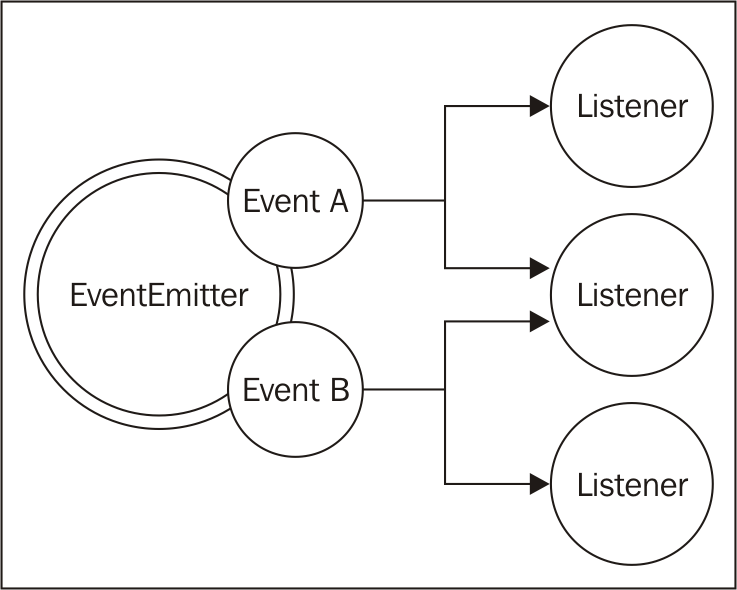

#2. Node.js Essential Patterns
    two of the most important asynchronous patterns: callback and event emitter
## The callback pattern
## The continuation-passing style
### Synchronous continuation-passing style
### Asynchronous continuation-passing style
  
## Non-continuation-passing style callbacks
    the result is returned synchronously using a direct style.
## Synchronous or asynchronous?
### An unpredictable function
One of the most dangerous situations is to have an API that behaves synchronously under
certain conditions and asynchronously under others. Let's take the following code as an
example:
```javascript
const fs = require('fs');
const cache = {};
function inconsistentRead(filename, callback) {
    if(cache[filename]) {
        //invoked synchronously
        callback(cache[filename]);
    } else {
        //asynchronous function
        fs.readFile(filename, 'utf8', (err, data) => {
            cache[filename] = data;
            callback(data);
        });
    }
}
```
### Unleashing Zalgo
Now, let's see how the use of an unpredictable function, such as the one that we defined
previously, can easily break an application. Consider the following code:
```javascript
function createFileReader(filename) {
    const listeners = [];
    inconsistentRead(filename, value => {
        listeners.forEach(listener => listener(value));
    });
    return {
        onDataReady: listener => listeners.push(listener)
    };
}
```
### Using synchronous APIs
The lesson to learn from the unleashing Zalgo example is that it is imperative for an API to
clearly define its nature: either synchronous or asynchronous.
###Deferred execution
Another alternative for fixing our inconsistentRead() function is to make it purely
asynchronous.The trick here is to schedule the synchronous callback invocation to be
executed “in the future” instead of being run immediately in the same event loop cycle. In
Node.js, this is possible using process.nextTick(), which defers the execution of a
function until the next pass of the event loop.

## Node.js callback conventions

### Callbacks come last
```javascript
fs.readFile(filename, [options], callback)
```
### Error comes first
```javascript
fs.readFile('foo.txt', 'utf8', (err, data) => {
    if(err)
        handleError(err);
    else
        processData(data);
});
```
It is best practice to always check for the presence of an error, as not doing so will make it
harder for us to debug our code and discover the possible points of failure. Another
important convention to take into account is that the error must always be of type Error.
This means that simple strings or numbers should never be passed as error objects.
### Propagating errors
Propagating errors in synchronous, direct style functions is done with the well-known
throw statement, which causes the error to jump up in the call stack until it is caught.
In asynchronous CPS however, proper error propagation is done by simply passing the
error to the next callback in the chain.
```javascript
const fs = require('fs');
function readJSON(filename, callback) {
    fs.readFile(filename, 'utf8', (err, data) => {
        let parsed;
        if(err)
            //propagate the error and exit the current function
            return callback(err);
        try {
            //parse the file contents
            parsed = JSON.parse(data);
            } catch(err) {
            //catch parsing errors
            return callback(err);
        }
        //no errors, propagate just the data
        callback(null, parsed);
    });
}
```
### Uncaught exceptions
Throwing inside an asynchronous callback will cause the exception
to jump up to the event loop and never be propagated to the next callback.
In Node.js, this is an unrecoverable state and the application will simply shut down
printing the error to the stderr interface.
```javascript
process.on('uncaughtException', (err) => {
    console.error('This will catch at last the ' + 'JSON parsing exception: ' + err.message);
    // Terminates the application with 1 (error) as exit code:
    // without the following line, the application would continue
    process.exit(1);
});
```

## 模块系统及其模式
### 展示模块模式
JavaScript 一个主要的问题是缺乏作用域，用于解决这种问题的一个流行技术是展示模块模式，它看上去如下所示：
```javascript
const module = (() => {
    const privateFoo = () => {...};
    const privateBar = [];
    const exported = {
        publicFoo: () => {...},
        publicBar: () => {...}
    };
    return exported;
})();
console.log(module);
```
该模式使用自我调用函数来创建一个私有作用域，仅仅导出共有部分。
## Node.js 模块说明
***CommonJS modules***
### 自制模块加载器
为了解释它的工作原理，让我们从头开始构建一个类似的系统。下面的代码将创建一个函数来模拟Node.js里面require函数的功能。
```javascript
function loadModule(filename, module, require) {
    const wrappedSrc=`(function(module, exports, require) {
    ${fs.readFileSync(filename, 'utf8')}
    })(module, module.exports, require);`;
    eval(wrappedSrc);
}
```
模块的源代码被包装成一个函数，如同展示模块模式，不同的是在这里我们传了一个参数列表。
```javascript 1.8
const require = (moduleName) => {
    console.log(`Require invoked for module: ${moduleName}`);
    const id = require.resolve(moduleName); //[1]
    if(require.cache[id]) { //[2]
        return require.cache[id].exports;
    }
    //module metadata
    const module = { //[3]
        exports: {},
        id: id
    };
    //Update the cache
    require.cache[id] = module; //[4]
    //load the module
    loadModule(id, module, require); //[5]
    //return exported variables
    return module.exports; //[6]
    };
    require.cache = {};
    require.resolve = (moduleName) => {
    /* resolve a full module id from the moduleName */
};
```
我们自制的模块加载系统做了如下工作：
1. 模块名称作为参数传入，第一件事就是解析模块的路径，称之为id。这项工作由require.resolve完成。
2. 如果模块之前被加载过，则其在缓存中可取，直接返回。
3. 如果模块还没有被加载，准备第一次加载的环境。具体是创建了一个module对象，该对象包含一个exports空对象属性，
这个属性将会用于模块导出任何公共的API。
4. module对象将会缓存module。
5. 模块源代码从其文件中读取，并对代码进行评估。给模块提供我们创建的module对象和一个指向require函数的引用，当前模块将使用module.exports对象导出公共API。
6. module.exports的内容将会返回给调用者。
###定义模块
看了上面的require函数如果工作后，我们应该知道怎样定义模块：
```javascript 1.8
//load another dependency
const dependency = require('./anotherModule');
    //a private function
function log() {
    console.log(`Well done ${dependency.username}`);
}
//the API to be exported for public use
module.exports.run = () => {
    log();
};
```
###定义全局变量
尽管在模块内声明的变量和函数是在其本地作用域内定义的，但是仍然可以定义全局变量。事实上模块系统暴露了一个特殊的变量global可以达到此目的。
### module.exports vs exports
exports变量只是module.exports初始值的一个引用。
这意味着我们可以通过exports变量来添加新属性：
```javascript 1.8
exports.hello = () => {
    console.log('Hello');
}
```
对exports重新赋值不会有任何影响，因为这不会改变module.exports的内容。如果我们希望导出对象以外的其他对象，例如函数、实例，
甚至字符串，我们可以这样对module.exports赋值：
```javascript
module.exports = () => {
    console.log('Hello');
}
```
### require 是同步函数
任何对module.exports的赋值必须为同步的。
这个属性对我们定义模块的方式有重要的影响。
### 解析算法
解析算法主要分为下面三种分支：
- 文件模块： 相对路径和绝对路径
- 核心模块： 如果模块名称没有以./和/开头，则从Node.js核心模块查找
- 包模块： 如果还没找到匹配模块名称的模块，则会查找node_modules
对于文件和包模块，单独的文件和路径可以匹配moduleName：
- moduleName.js
- moduleName/index.js
- moduleName/package.json里面main属性指定的文件或者路径
### 模块缓存
每个模块只在第一次加载时进行评估，因此后来任何的require调用将会简单地返回缓存。模块缓存是通过require.cache变量暴露，如有需要，可以直接访问。
### 循环依赖
许多人认为循环依赖是一个内在的设计问题，然而它是有时会在实际工作中遇到的，因此有必要了解这在node.js里如何产生的：
假设我们有如下两个模块：
- Module a.js
```javascript
exports.loaded = false;
const b = require('./b');
module.exports = {
    bWasLoaded: b.loaded,
    loaded: true
};
```
- Module b.js
```javascript
exports.loaded = false;
const a = require('./a');
module.exports = {
    aWasLoaded: a.loaded,
    loaded: true
};
```
现在，让我们尝试从另一个模块main.js加载它们：
```javascript
const a = require('./a');
const b = require('./b');
console.log(a);
console.log(b);
```
前面的代码将打印以下输出：
```javascript
{ bWasLoaded: true, loaded: true }
{ aWasLoaded: false, loaded: true }
```
##模块定义模式
模块系统除了是一个加载依赖关系的机制，也是一个定义API工具。在本节中，我们将分析在Node.js中一些最流行的模块定义模式；每个模式都平衡了信息隐藏，扩展和代码重用。
###命名exports
```javascript
//file logger.js
exports.info = (message) => {
    console.log('info: ' + message);
};
exports.verbose = (message) => {
    console.log('verbose: ' + message);
};
```
到处的函数将会成为加载模块的属性:
```javascript
//file main.js
const logger = require('./logger');
logger.info('This is an informational message');
logger.verbose('This is a verbose message');
```
###导出一个函数
最受欢迎的一个模块定义模式，包括重新分配整个函数给module.exports变量：
```javascript
//file logger.js
module.exports = (message) => {
    console.log(`info: ${message}`);
};
```
这种模式的一种可能扩展方式是使用这个导出的函数作为其它公共API的作用域：
```javascript
module.exports.verbose = (message) => {
    console.log(`verbose: ${message}`);
};
```
下面的代码演示如何使用我们刚才定义的模块：
```javascript
//file main.js
const logger = require('./logger');
logger('This is an informational message');
logger.verbose('This is a verbose message');
```
***模式（substack）*** 只通过导出一个函数来公开模块的主要功能。使用导出函数作为命名空间来公开任何辅助功能
###导出一个构造函数
    导出一个构造函数模块是导出一个函数模块的特殊化。不同之处在于，在这个新模式下，
    允许用户使用构造函数创建实例，同样给客户扩展原型和创造新类的能力：
```javascript
//file logger.js
function Logger(name) {
    this.name = name;
}
Logger.prototype.log = function(message) {
    console.log(`[${this.name}] ${message}`);
};
Logger.prototype.info = function(message) {
    this.log(`info: ${message}`);
};
Logger.prototype.verbose = function(message) {
    this.log(`verbose: ${message}`);
};
module.exports = Logger;
```
使用前面的模块：
```javascript
//file main.js
const Logger = require('./logger');
const dbLogger = new Logger('DB');
dbLogger.info('This is an informational message');
const accessLogger = new Logger('ACCESS');
accessLogger.verbose('This is a verbose message');
```
应对模式变化，将该模式变成工厂模式：
```javascript
function Logger(name) {
    if(!(this instanceof Logger)) {
        return new Logger(name);
    }
    this.name = name;
};

//file logger.js
const Logger = require('./logger');
const dbLogger = Logger('DB');
accessLogger.verbose('This is a verbose message');

function Logger(name) {
    if(!new.target) {
        return new LoggerConstructor(name);
    }
    this.name = name;
}
```
###导出一个实例
我们可以利用缓存机制require()轻松定义状态实例，该实例具有从构造函数或工厂创建的状态，可以在不同的模块间共享。
```javascript
//file logger.js
function Logger(name) {
    this.count = 0;
    this.name = name;
}

Logger.prototype.log = function(message) {
    this.count++;
    console.log('[' + this.name + '] ' + message);
};
module.exports = new Logger('DEFAULT');
```
新定义的模块可以使用如下：
```javascript
//file main.js
const logger = require('./logger');
logger.log('This is an informational message');
```
因为模块被缓存了，每个要加载logger模块的其它模块实际上会得到一个同样的对象实例。
###修改其它模块或者全局变量
##观察者模式
###EventEmitter类

获取EventEmitter引用：
```javascript
const EventEmitter = require('events').EventEmitter;
const eeInstance = new EventEmitter();
```
EventEmitter的基本方法如下：
- on(event, listener):该方法允许为指定的事件(a string)注册一个新的听众(a function)
- once(event, listener):同上，但listener只被触发一次然后被移除
- emit(evnet, [arg1], [...]):该方法产生一个新的事件，同时给listener传递参数
- removeListener(event, listener):该方法移除指定事件类型的一个listenre
所有上述方法将返回EventEmitter实例允许链接。
## 创建和使用EventEmitter
```javascript
const EventEmitter = require('events').EventEmitter;
const fs = require('fs');
function findPattern(files, regex) {
    const emitter = new EventEmitter();
    files.forEach(function(file) {
        fs.readFile(file, 'utf8', (err, content) => {
            if(err)
                return emitter.emit('error', err);
            emitter.emit('fileread', file);
            let match;
            if(match = content.match(regex))
                match.forEach(elem => emitter.emit('found', file, elem));
        });
    });
    return emitter;
}

findPattern(
['fileA.txt', 'fileB.json'],
/hello \w+/g
)
.on('fileread', file => console.log(file + ' was read'))
.on('found', (file, match) => console.log('Matched "' + match +
'" in file ' + file))
.on('error', err => console.log('Error emitted: ' + err.message));
```
### 传递错误
注册error时间，如果该事件没有listener，node.js将抛出异常并退出。
### 使任何对象observable
extending EventEmitter 类
```javascript
const EventEmitter = require('events').EventEmitter;
const fs = require('fs');
class FindPattern extends EventEmitter {
    constructor (regex) {
        super();
        this.regex = regex;
        this.files = [];
    }
    addFile (file) {
        this.files.push(file);
        return this;
    }
    find () {
        this.files.forEach( file => {
            fs.readFile(file, 'utf8', (err, content) => {
                if (err) {
                    return this.emit('error', err);
                }
                this.emit('fileread', file);
                let match = null;
                if (match = content.match(this.regex)) {
                    match.forEach(elem => this.emit('found', file, elem));
                }
            });
        });
        return this;
    }
}
```
使用：
```javascript
const findPatternObject = new FindPattern(/hello \w+/);
findPatternObject
.addFile('fileA.txt')
.addFile('fileB.json')
.find()
.on('found', (file, match) => console.log(`Matched "${match}"in file ${file}`))
.on('error', err => console.log(`Error emitted ${err.message}`));
```
###同步和异步事件
发射同步和异步事件的主要区别在于侦听器的注册方式。
###Event Emitter  vs callbacks
定义异步API时一个常见的困境时检查是否使用EventEmitter还是简单地使用callback。一般的区分规则是语义：
结果必须是以异步方式返回时应使用回调；当需要交流某事物刚好发生时，应该使用事件。
    EventEmitter优点多于callback
###结合callbacks和EventEmitter
```javascript
glob(pattern, [options], callback)
const glob = require('glob');
glob('data/*.txt', (error, files) => console.log(`All files found:${JSON.stringify(files)}`))
.on('match', match => console.log(`Match found: ${match}`));
```
***Pattern*** ：创建一个接受callback同时返回EventEmitter的函数，这样既为主要功能提供简单清晰的入口，同时可以使用EventEmitter触发更多细致的事件。
