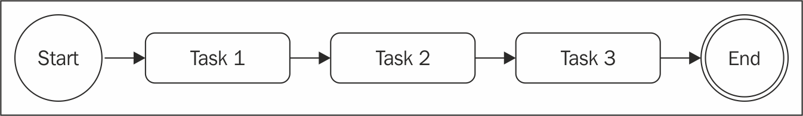
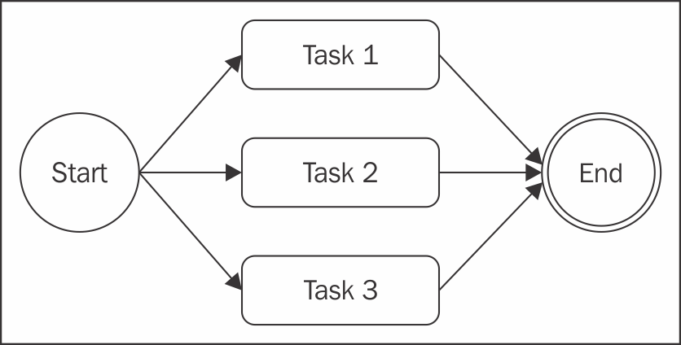
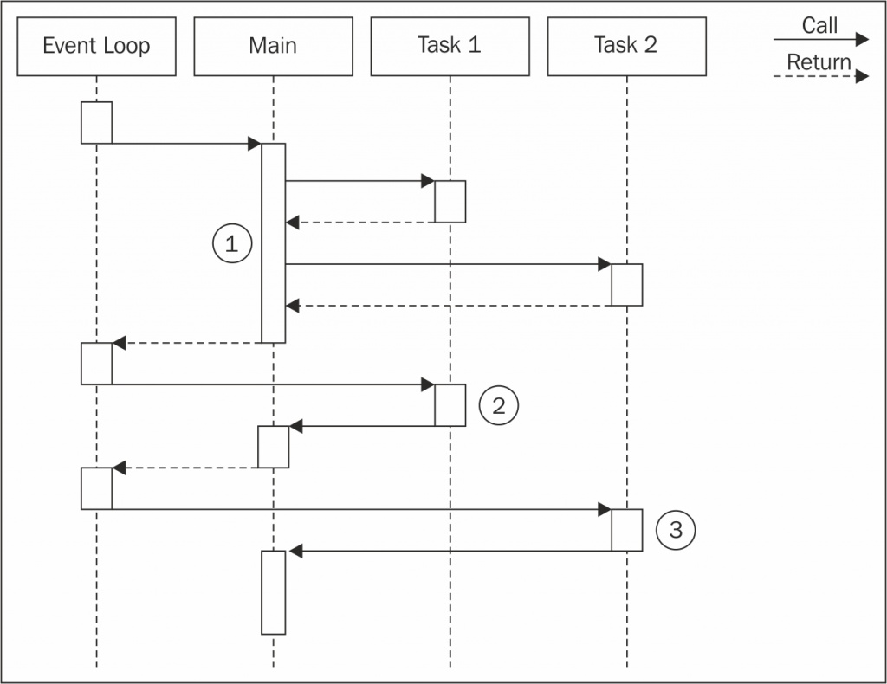
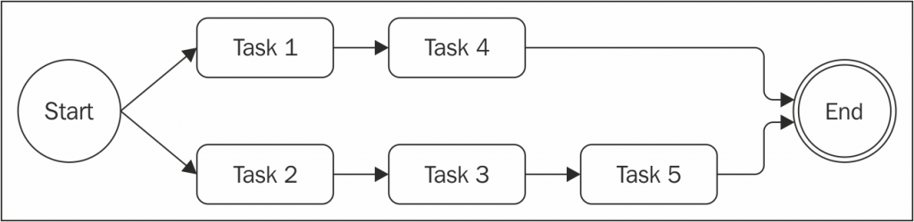

#带回调函数的异步控制流模式
##异步编程的难处
异步代码容易失去控制，如回调地狱
##创建一个简单的web spider
为了解释这个问题，我们将创建一个小的Webspider，一个命令行应用程序。将Web URL作为输入，并将下载其内容到本地文件中。在代码中，我们将会用到一些npm依赖包：
- request： A library to streamline HTTP calls
- mkdirp: 递归创建目录的小工具
### 回调地狱
## 使用简单的Javascript
在异步代码中，回调地狱不是唯一需要引起注意的。
在这一节，我们将学习如何避免回调地狱同时使用简单的javascript来实现常用的控制流模式。
### Callback 约定准则
编写异步代码时，首先要记住的是当定义回调时不要滥用闭包。这样做是很诱人的，因为它不需要任何对模块化和可重用性等问题的进一步思考。
这些是一些基本的原则，可以帮助我们保持嵌套级别低并且改进一般代码的组织：
- You must exit as soon as possible
- You need to create named functions for callbacks, keeping them out of closures
  and passing intermediate results as arguments
- You need to modularize the code.Split the code into smaller, reusable functions
## 顺序执行
现在我们开始探索异步控制流模式。我们将从分析顺序执行流程开始。  
  
这个流图有几种变种：  
- 按顺序执行一组已知的任务，没有链式或者传递结果
- 将一个任务的输出作为下一个任务的输入(链式、管道、流)
- 迭代一个集合，在每一个元素上一个接一个执行异步任务
### 顺序执行一组已知的任务
```javascript
function task1(callback) {
    asyncOperation(() => {
        task2(callback);
    });
}
function task2(callback) {
    asyncOperation(result () => {
        task3(callback);
    });
}
function task3(callback) {
    asyncOperation(() => {
        callback(); //finally executes the callback
    });
}
task1(() => {
    //executed when task1, task2 and task3 are completed
    console.log('tasks 1, 2 and 3 executed');
});
```
##顺序迭代
希望为集合中的每一项执行异步操作
### Web spoder version 2
###顺序搜索链接
***Pattern(sequential iterator))*** : 通过创建一个名为迭代器的函数按顺序执行任务列表
## 并行执行
  
下图演示了Node.js程序里面两个异步任务能够并行运行

- 主函数触发了任务1和任务2的执行。由于触发的是异步操作，会立即将控制返回到主函数，然后主函数将控制返回给事件循环
- 当任务1的异步操作完成后，事件循环将把控制交给任务1，当任务1完成其内部的同步处理后，将会通知主函数
- 当任务2 触发的异步操作完成后，事件循环调用回调，将控制传给任务2，任务2 结束后，主函数得到通知。这个时候，主函数已经知道任务1和任务2 都已经完成。
  
  简短来讲，这意味着，在Node.js里面，我们仅仅能够并行的执行异步操作，因为它们的并发是由其非阻塞API在内部处理的。
### Web spider version 3
### The pattern
```javascript
const tasks = [ /* ... */ ];
let completed = 0;
tasks.forEach(task => {
    task(() => {
        if(++completed === tasks.length) {
            finish();
        }
    });
});
function finish() {
    //all the tasks completed
}
```
***Pattern (unlimited parallel execution)***   
**一次性创建一个集合中所有异步任务的并行执行，然后使用回调函数调用次数的方式来等待所有任务完成。**
###解决并发任务中的竞争条件
Node.js竞争条件主要是的根源是异步操作调用与它的通知之间的延迟结果。
##限制并行执行
受资源限制，不能同时并发太多。

### 限制并发
```javascript
const tasks = ...
let concurrency = 2, running = 0, completed = 0, index = 0;
function next() { //[1]
    while(running < concurrency && index < tasks.length) {
        task = tasks[index++];
        task(() => { //[2]
        if(completed === tasks.length) {
            return finish();
        }
        completed++, running--;
        next();
        });
        running++;
    }
}
next();
function finish() {
    //all tasks finished
}
```
## 全局限制并发
### 排队等候
```javascript
class TaskQueue {
    constructor(concurrency) {
        this.concurrency = concurrency;
        this.running = 0;
        this.queue = [];
    }
    pushTask(task) {
        this.queue.push(task);
        this.next();
    }
    next() {
        while(this.running < this.concurrency && this.queue.length) {
            const task = this.queue.shift();
            task(() => {
                this.running--;
                this.next();
            });
            this.running++;
        }
    }
};
```
## async库
### 顺序执行
### 并行执行
### 限制并行执行

